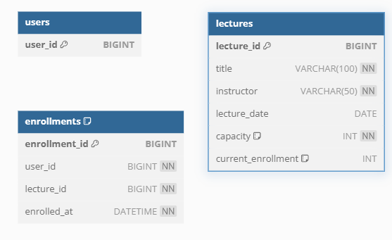

# 항해 2주차 클린아키텍처

### 핵심 요구사항
- 아래 API 를 구현합니다.
    - 특강 신청 가능 목록 조회 API
    - 특강 신청 API
    - 특강 신청 완료 목록 조회 API
- 각 기능 및 제약 사항에 대해 단위 테스트를 반드시 하나 이상 작성하도록 합니다.
- 다수의 인스턴스로 어플리케이션이 동작하더라도 기능에 문제가 없도록 작성하도록 합니다.
- 동시성 이슈를 고려 하여 구현합니다.
- **DB 는 MySQL / MariaDB 로 제한합니다.**
- **Test 는 (1) 인메모리 DB (2) docker-compose 정도 허용합니다. ( + TestContainers 이용해도 됨 )**

### API Specs
1. (핵심) 특강 신청 API

- 특정 userId 로 선착순으로 제공되는 특강을 신청하는 API 를 작성합니다.
- 동일한 신청자는 동일한 강의에 대해서 한 번의 수강 신청만 성공할 수 있습니다.
- 특강은 선착순 30명만 신청 가능합니다.
- 이미 신청자가 30명이 초과 되면 이후 신청자는 요청을 실패합니다.

2. 특강 신청 가능 목록 API**

- 날짜별로 현재 신청 가능한 특강 목록을 조회하는 API 를 작성합니다.
- 특강의 정원은 30명으로 고정이며, 사용자는 각 특강에 신청하기 전 목록을 조회해 볼 수 있어야 합니다.

3. 특강 신청 완료 목록 조회 API**

- 특정 userId 로 신청 완료된 특강 목록을 조회하는 API 를 작성합니다.
- 각 항목은 특강 ID 및 이름, 강연자 정보를 담고 있어야 합니다.

### KEY POINT

- 정확하게 30 명의 사용자에게만 특강을 제공할 방법을 고민해 봅니다.
- 같은 사용자에게 여러 번의 특강 슬롯이 제공되지 않도록 제한할 방법을 고민해 봅니다.

## 요구사항 분석

1. 특강 신청 가능 목록 조회 API

- GET /api/lectures/avaliable
- response: 신청 가능한 특강 목록(특강 ID, 특강 이름, 강연자 정보, 잔여 정원)
- 이미 시작된 특강 제외(날짜 정보 확인)

2. 특강 신청 API

- POST /api/lectures/{lectureId}/apply
- 특정 특강에 대해 userId로 선착순 신청
- request Body: 
{ "userId": "string" }
- reponse: 신청 성공 혹은 실패 메시지.

3. 특강 신청 완료 목록 조회 API

- GET /api/lectures/completed
- userId로 신청 완료된 특강 목록 조회.

### 고려사항
1. 특강 신청 API

- 동일한 userId가 동일한 특강에 중복 신청하지 않도록 검증 로직 필요
- 선착순 동작을 보장하기 위해 동시성 이슈 방지할 방법 필요

2. 특강 신청 가능 목록 API

- 현재 신청 가능 여부(정원이 초과되지 않는 특강)로직 필요

3. 특강 신청 완료 목록 조회 API

- userId로 신청 완료된 특강 목록을 조회

### 데이터베이스 
1. 신청 중복방지를 위해 신청테이블(enrollments)에는 신청자(users) 특강(lectures) 에서 각각 Id를 enrollments 테이블의 컬럼으로 넣도록 한다.
- userId와 lectureId는 FK가 아님 -> deadlock, 성능 저하 방지 등 -> 대신 lectureId와 userId에 index를 걸기로 했다.
- userId와 lectureId는 unique constraint 걸도록 한다 -> 중복 신청 방지를 DB에서 처리하겠다.
- 30명 제한을 해결하기 위해 특강테이블(lectures)에 enroll_count를 +1씩 증가시키기로 한다.
- 동시성 제어를 위해 DB레벨 Lock을 사용한다.
- Transaction처리: 신청 처리 중 실패 시 데이터 무결성을 유지하기 위해 롤백 설계한다.


### 테스트케이스

#### 1. 특강 신청 API
##### 01. 정상케이스
- 동일한 userId로 신청 가능한 특강에 정상적으로 신청.
- 30명 정원 미달 상태에서 신청 성공.
- 
##### 02. 에러 케이스

- 동일한 userId가 이미 신청한 강의에 대해 중복 신청 시도.
- 정원이 30명 초과된 상태에서 신청 시도.
- 존재하지 않는 lectureId로 신청 시도.
- 잘못된 형식의 요청 데이터 (예: userId 누락).

#### 2. 동시성 테스트

- 동일 강의에 다수의 사용자(31명 이상)가 동시에 신청 시, 정확히 30명까지만 성공.
- 동시에 동일한 userId가 동일 강의를 신청하려는 상황에서 중복 처리 방지.

##### 01. 트랜잭션 테스트

- 신청 중 실패 발생 시 데이터 롤백 확인.
- 성공 시 데이터가 정확히 저장되었는지 확인.

#### 3. 특강 신청 가능 목록 API

##### 01. 정상 케이스

날짜별로 신청 가능 특강 목록이 정상적으로 반환.
정원이 30명 미만인 특강만 반환.
반환 데이터에 lectureId, 이름, 강연자, 잔여 정원이 포함.

##### 02. 에러 케이스

- 신청 가능한 특강이 없는 경우, 빈 목록 반환.

##### 03. 경계값 테스트

- 정원이 정확히 30명인 특강이 반환되지 않는지 확인.
- 신청 가능 특강이 다수일 때 확인.

#### 4. 특강 신청 완료 목록 조회 API 
##### 01. 정상 케이스
- 특정 userId로 신청 완료된 특강 목록이 정상적으로 반환.
- 반환 데이터에 lectureId, 이름, 강연자 정보 포함.

##### 02.에러 케이스

- 특강 신청 이력이 없는 userId로 요청.

#### 05. 데이터베이스 테스트
##### 01.정상 케이스

- 특강 신청 시 데이터베이스에 정상적으로 데이터 저장 (LectureApplication).
- 정원이 초과되지 않는 상황에서 신청 가능 여부 쿼리.

##### 02. 에러 케이스

- Unique Key 위반 (userId + lectureId 중복) 시 데이터 저장 실패.
- 정원이 초과된 상태에서 정원 증가 없이 처리.

- ##### 03. 동시성 테스트

- 다수의 인스턴스에서 동일 강의에 신청 시, 정원 초과 방지 확인.
- DB Lock을 통한 동시성 제어 검증.

#### 6. 성능 테스트
##### 01. 특강 신청 API

- 100명 이상의 사용자 요청을 동시에 처리할 때 성능 확인.
- 200명 이상의 사용자 요청을 동시에 처리할 때 성능 확인.
- 동시에 신청 가능한 특강 목록 조회 시, 정원에 따른 특강 반환 확인
-

##### 02. 경계값 테스트
- 특강 신청
-> 정원이 29명, 30명, 31명일 때 각각의 처리 결과 확인. 100건의 다른 사용자 요청에 따라 동시성 제어가 가능할 것인기 확인
특강 신청 가능 목록
경계 날짜(예: 오늘, 내일)로 필터링 결과 확인.
신청 완료 목록
신청 내역이 없는 경우와 많은 경우(예: 1000건 이상) 모두 확인.

### 패키지 구조

```plaintext
/src/main/java/com/hanghae/lecture
├── LectureApplication.java
├── interfaces                    // 외부와의 상호작용 담당
│   ├── api
│   │   ├── ControllerFacade.java             // API 요청을 통합 관리
│   │   ├── LectureController.java            // 특강 관련 요청 관리
│   │   ├── LectureRegistrationController.java // 신청 관련 요청 관리
│   │   └── exception
│   │       └── GlobalExceptionHandler.java   // 공통 예외 처리
│   ├── dto
│   │   ├── LectureRequestDto.java            // 특강 요청 DTO
│   │   ├── LectureResponseDto.java           // 특강 응답 DTO
│   │   ├── LectureRegistrationDto.java       // 신청 요청 DTO
│   │   └── ErrorResponse.java                // 공통 에러 응답
│   └── mapper                                 // DTO ↔ 도메인 변환
│       ├── LectureMapper.java
│       └── LectureRegistrationMapper.java
├── application                   // 비즈니스 유즈케이스와 서비스 로직
│   ├── LectureFacade.java              // 특강 및 신청 비즈니스 로직 조율
│   ├── LectureService.java             // 특강 서비스 인터페이스
│   ├── LectureServiceImpl.java         // 특강 서비스 구현체
│   ├── LectureRegistrationService.java // 신청 서비스 인터페이스
│   ├── LectureRegistrationServiceImpl.java // 신청 서비스 구현체
│   └── exception
│       └── LectureNotFoundException.java    // 특강 찾을 수 없음 예외
├── domain                        // 핵심 비즈니스 로직과 데이터 상태 관리
│   ├── Lecture.java                    // 특강 도메인 객체 및 Entity
│   ├── LectureRegistration.java
```

### ERD


```
CREATE TABLE users (
user_id BIGINT AUTO_INCREMENT PRIMARY KEY
);

CREATE TABLE lectures (
lecture_id BIGINT AUTO_INCREMENT PRIMARY KEY,
title VARCHAR(100) NOT NULL,
instructor VARCHAR(50) NOT NULL,
lecture_date DATE,
capacity INT NOT NULL DEFAULT 30,
current_enrollment INT DEFAULT 0
);

CREATE TABLE enrollments (
enrollment_id BIGINT AUTO_INCREMENT PRIMARY KEY,
user_id BIGINT NOT NULL,
lecture_id BIGINT NOT NULL,
enrolled_at DATETIME NOT NULL,
UNIQUE KEY unique_user_lecture (user_id, lecture_id), -- 신청 중복방지
KEY idx_user_id (user_id),                           -- 인덱스 1
KEY idx_lecture_id (lecture_id)                      -- 인덱스 2
);
```

1. users(신청 유저) 테이블
- user_id: 신청자 고유 아이디

2. lectures(특강 정보) 테이블
- lecture_id: 특강 고유 아이디
- title: 튺강 제목
- instructor: 강연자
- lecture_date: 특강일
- capacity: 특강 제한 인원
- current_enrollment: 특강 신청 인원

3. enrollments(특강신청) 테이블
- enrollment_id: 특강 신청 공유 아이디
- user_id: 신청자 아이디
- lecture_id: 특강 아이디
- enrolled_at: 특강 신청 시간

01. 사용자 및 강의 정보 관리: users 테이블은 사용자 정보를 저장하고, lectures 테이블은 강의 정보를 관리하여 두 테이블 간의 관계를 설정합니다.

02. 신청 중복 방지: enrollments 테이블에 UNIQUE KEY unique_user_lecture (user_id, lecture_id)를 추가하여 동일한 사용자가 같은 강의를 중복 신청할 수 없도록 보장합니다.

03. 강의 정원 관리: lectures 테이블의 capacity와 current_enrollment 컬럼을 사용하여 강의의 정원 및 현재 수강 인원을 추적합니다.

04. 효율적인 조회를 위한 인덱스 설정: enrollments 테이블에 user_id와 lecture_id에 각각 인덱스를 설정하여, 빠른 검색과 성능 최적화를 도모합니다.

05. 신청 성공 사용자만 등록: 특강 신청에 실패한 사용자는 fail 처리되므로, enrollments 테이블에는 신청에 성공한 사용자만 등록됩니다.

06. 외래키를 설정하지 않은 이유: 테이블 간에 외래키를 설정하지 않은 이유는 DB에 lock이 걸렸을 시 참조 테이블에도 연쇄적으로 lock이 걸리지 않도록 하기 위함입니다.

### KEY POINT SOLVED THINKING
1. 클린 아키텍쳐를 이해하고 지향하기 
-> 기존 레이어드 아키텍처의 Service를 애플리케이션 서비스와 도메인 서비스로 나누고, 비즈니스 로직을 도메인 계층(Entity, Value Object 등)에 위임함
-> why? 그랬을까 이해하고 학습하기
2. DB 설계 및 동시성 제어 관점 이해하기
-> 다수의 인스턴스에서 사용자가 요청할 때는 lock을 어떻게 걸어야 하는가 학습하기

### 현재 문제점
1. DB 비관적 lock 제어시 제한된 정원 인원은 보장하나 선착순으로 신청이 성공하지 않는다.
2. 테스트 코드 -> 프로덕트 코드로 작업을 진행해야하나, 촉박한 시간에 밀려 일부는 프로덕트 코드를 짜고 테스트를 진행했기 때문에
쓸데없는 프로덕트 코드가 오염되었다. 
3. 시간에 촉박하여 커밋단위의 메시지를 조절하지 못하였다. 파일도 깔끔하게 정리하지 못했다.

